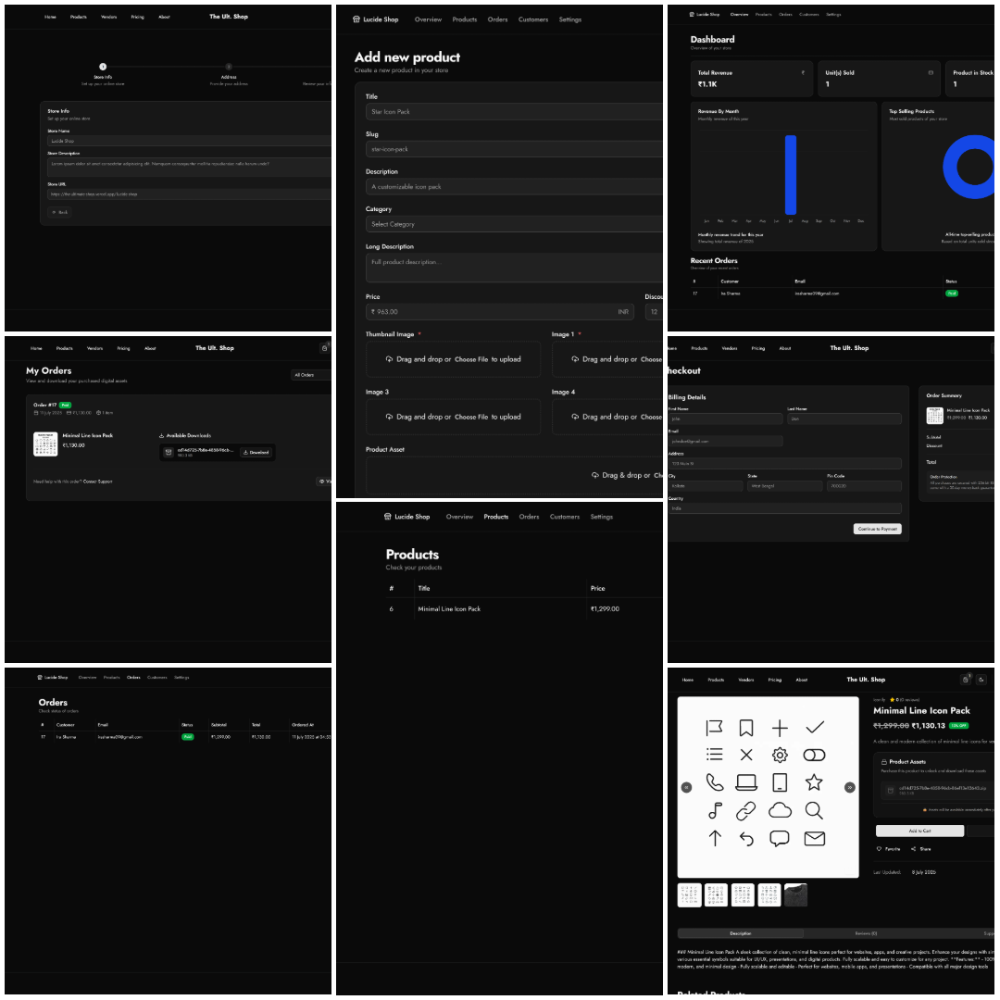

# The Ultimate Shop – Full-Stack eCommerce Platform with Next.js, Tailwind CSS, Clerk & PayU

> A modern, open-source, full-stack eCommerce starter template built with Next.js App Router, Tailwind CSS, Clerk for authentication, Drizzle ORM, Shadcn UI, and PayU payment gateway. Ideal for developers looking to launch scalable and secure online stores quickly.


## Features

- **Next.js App Router** for optimized routing & performance.
- **Tailwind CSS** + **Shadcn UI** for fully responsive modern design.
- **Authentication with Clerk** – Sign up, login, and account management.
- **Integrated Payments** using PayU for smooth transactions.
- **Product Uploads & Management** with Edgestore and Pinata.
- **Shopping Cart, Orders & Checkout** functionality built-in.
- **Drizzle ORM** for typed and maintainable PostgreSQL database queries.
- Fully configured **Husky**, **ESLint**, **Prettier**, and **Github Actions** for development consistency

## Screenshots



## Tech Stack

- **Framework:** [Next.js](https://nextjs.org)
- **Styling:** [Tailwind CSS](https://tailwindcss.com)
- **Authentication:** [Clerk](https://clerk.com)
- **Database/ORM:** [Drizzle](https://orm.drizzle.team)
- **UI:** [Shadcn UI](https://ui.shadcn.com)
- **File Uploads:** [Edgestore](https://edgestore.dev) & [Pinata](https://pinata.cloud)
- **Payment Infra:** [PayU](https://payu.in)

## Getting Started

### 1. Clone this project

1. Using `git clone`

```bash
git clone https://github.com/agambagish/the-ultimate-shop.git
```

2. Using `create-next-app`

```bash
pnpm create next-app -e https://github.com/agambagish/the-ultimate-shop the-ultimate-shop
```

### 2. Install dependencies

```bash
pnpm i
```

### 3. Set up environment variables

Create `.env` file and set env variables from `.env.example` file.

### 4. Prepare husky

```bash
pnpm prepare
```

### 5. Run dev server

```bash
pnpm dev:all
```

Open http://localhost:3000 to see the app.

## Contribution

To contribute, please follow these steps:

1. Fork the repository.
2. Create a new branch.
3. Make your changes, & commit them.
4. Push your changes to the forked repository.
5. Create a pull request.

## Support

If you found this project helpful, give it a star on GitHub ⭐

Share it with others, contribute, or build your next eCommerce product with it!

## License

This project is licensed under the [MIT License](./LICENSE).
